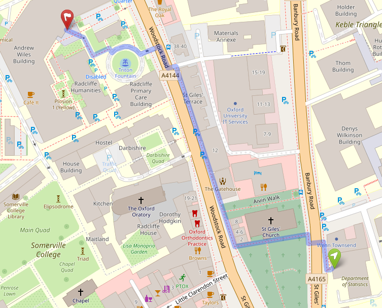

Courses will be on April 14th. 

You can sign up for one or two half-day courses. 


# Invited courses


## An Introduction to Single-World Intervention Graphs with Applications to Identification and Mediation, by Professor Thomas Richardson and Mats J. Stensrud

__Location:__ TBD</br>
__Start time:__ 9:00 with a coffee break</br>
__End time:__ 12:00</br>


::: {layout-ncol=3}


:::

Causal models based on potential outcomes, also known as counterfactuals, were introduced by Neyman (1923) and extended to observational settings by Rubin (1974). Causal Directed Acyclic Graphs (DAGs) are another framework, originally introduced by Wright (1921), but subsequently significantly generalized and extended by Spirtes et al. (1993), Pearl (1995), and Dawid (2002), among others.

We will first present a simple approach to unifying these two approaches via Single-World Intervention Graphs (SWIGs). The SWIG encodes the counterfactual independences associated with a specific hypothetical intervention on a set of treatment variables. The nodes on the SWIG are the corresponding counterfactual random variables. This represents a counterfactual model originally introduced by Robins (1986) using event trees, known as Finest Fully Randomized Causally Interpretable Structured Tree Graphs (FFRCISTG).

We will use this synthesis, to describe the potential outcome (po) calculus, introduced by Malinsky et al. (2019). These rules are similar to, but simpler than, the do-calculus of Pearl (1995) and clarify the underlying concepts involved. We will outline a complete algorithm for deriving identifying expressions for counterfactual causal queries.

By expanding the graph, SWIGs may also be used to describe a novel interventionist approach to mediation analysis whereby treatment is decomposed into multiple separable components. This provides a means of discussing direct effects without reference to "cross-world" independence assumptions, nested counterfactuals or interventions on the mediator. The theory preserves the dictum "no causation without manipulation" and makes questions of mediation empirically testable in future randomized controlled trials.

This is joint work with James M. Robins (Harvard) and Ilya Shpitser (Johns Hopkins).


## A Modicum of Proximal Causal Learning, by Professor Eric Tchetgen Tchetgen

__Location:__ TBD</br>
__Start time:__ 13:00 with a coffee break</br>
__End time:__ 16:00</br>


Learning about causal effects from observational data often relies on strong assumptions that one has perfectly measured important confounding, mediating or moderating factors. This short course will introduce proximal causal learning, which aims to soften this stringent and unrealistic requirement, by treating the observed data as proxies of known but imperfectly measured confounding, mediating and moderating factors. Participants will learn about proximal methods to empirically account for unmeasured confounders, hidden mediators and error prone effect moderators. The course will focus on concepts and ideas with sprinkles of data applications in the health and social sciences throughout, rather than technicalities.


# Recurring courses -- Pre-conference introduction


::: {layout-ncol=3}


:::


## Introduction to Causal Inference, by Rhian Daniel (Cardiff University) and Erin Gabriel (University of Copenhagen)

__Location:__ TBD</br>
__Start time:__ 9:00 with a coffee break</br>
__End time:__ 12:00</br>

This course (which had its first incarnation at the UK-CIM 2016) is a whistlestop tour of the concepts and methods of causal inference, aimed at an audience of newcomers to the area, but who have a working knowledge of topics such as regression models. The emphasis is on giving enough background on the basic ideas so that the Euro-CIM meeting can be enjoyed without feeling lost. The material covered might therefore change slightly once the final programme for the meeting is known, but is likely to include:

- the different languages of causality, e.g. do-notation, potential outcomes
- how these languages express causal effects
- the sorts of assumptions often relied upon to identify causal effects, and the meaning of identification
- graphical models used in causal inference, including DAGs and SWIGs
- regression models as causal models
- methods based on the propensity score

The fact that the list above is far too long for a half-day course gives an impression of the nature of the workshop - rather than dwell on all the intricacies of the various methods and approaches, and how one might apply them in practice using computer packages, the focus will instead be on imparting the main ideas before moving swiftly on to the next topic.


## Special Topics in Causal Inference, organized by Rhian Daniel (Cardiff University) and Erin Gabriel (University of Copenhagen)

__Location:__ TBD</br>
__Start time:__ 13:00 with a coffee break</br>
__End time:__ 16:00</br>

This is a continuation of the Introduction course, where we will dive deeper into specialized tools and methods. The list below gives some examples, but may be changed or expanded to highlight some of the themes and topics that will be spoken about at the conference. 

- instrumental variable methods, including Mendelian randomisation
- sustained exposures and time-varying confounders
- target trial emulation
- mediation analysis


# Information 

Some of the courses will be in the University of Oxford Department of Statistics, 24-29 St Giles', Oxford OX1 3LB. Lunch for all course attendees will be in the Andrew Wiles Building, Woodstock Rd, Oxford OX2 6GG. See the map below for a walking route between the buildings. 

```{r}
#| include: false

library(leaflet)
library(htmltools)
library(fontawesome)

topoData <- readLines("images/route.geojson") %>% paste(collapse = "\n") 

leaflet()  |> 
  addTiles() |> 
  setView(lat = 51.75909315018185, lng = -1.26043728690375, zoom = 17) |> 
  addGeoJSON(topoData, fill = FALSE, color = "red")

```




