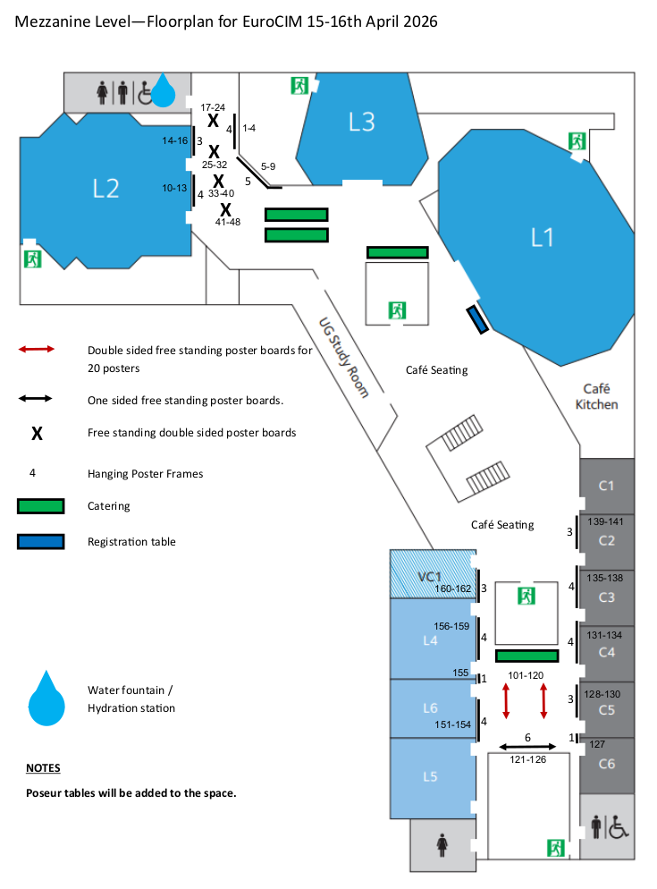

# Information

[More information for poster presenters](poster-information.qmd)

Poster numbers start with a letter indicating the day followed by a number indicating the location. 

Please check the poster number and refer to the map below for the location where it should be posted. 





```{r}
#| echo: false

post <- subset(read.csv("../data/Eurocim2026_updated319.csv"), !is.na(poster.number))
utf8 <- read.csv("../data/goodstracts.csv")
post <- merge(post, utf8, by = "Email.Address", all.x = TRUE)

post$authfullname <- paste(post$Presenting.author.s.first.name.s..y, post$Presenting.author.s.surname.y)

post$day <- substr(post$poster.number, 1, 1)
post$digit <- as.numeric(substr(post$poster.number, 2, nchar(post$poster.number)))

wed<- subset(post, day == "W")
wed <- wed[order(wed$digit),]
thu <- subset(post, day == "T")
thu <- thu[order(thu$digit),]
```


::: {.panel-tabset}

# Wednesday, April 15

```{r}
#| echo: false
#| output: asis

for(i in 1:nrow(wed)) {
  
  cat(sprintf("## %s: %s {.battle-teaser}", wed$poster.number[i], wed$Title.of.submission..max.250.characters..y[i]), "\n\n")
  cat(sprintf("__Author__: %s, %s \n\n\n<details><summary>__Abstract__</summary> %s \n\n\n", wed$authfullname[i], wed$Presenting.author.s.affiliation..Department.group..institute..country..y[i], wed$Abstract..max.1250.characters..y[i]))
  
  if(!is.na(wed$Full.names.and.affiliations.of.coauthors.y[i]) & 
     !(wed$Full.names.and.affiliations.of.coauthors.y[i] == "")){
    cat(sprintf("\n\n Coauthors: %s", wed$Full.names.and.affiliations.of.coauthors.y[i]), "\n\n")
  }
  
  cat("</details>\n\n\n")
}
```


# Thursday, April 16

```{r}
#| echo: false
#| output: asis

for(i in 1:nrow(thu)) {
  
  cat(sprintf("## %s: %s {.battle-teaser}", thu$poster.number[i], thu$Title.of.submission..max.250.characters..y[i]), "\n\n")
  cat(sprintf("__Author__: %s, %s \n\n\n <details><summary>__Abstract__</summary> %s \n\n\n", thu$authfullname[i], thu$Presenting.author.s.affiliation..Department.group..institute..country..y[i], thu$Abstract..max.1250.characters..y[i]))
  
  if(!is.na(thu$Full.names.and.affiliations.of.coauthors.y[i])& 
     !(thu$Full.names.and.affiliations.of.coauthors.y[i] == "")){
    cat(sprintf("\n\n Coauthors: %s", thu$Full.names.and.affiliations.of.coauthors.y[i]), "\n\n")
  }
  cat("</details>\n\n\n")
}
```
:::
